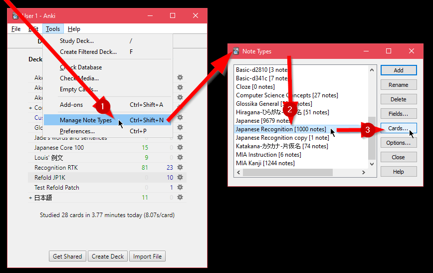
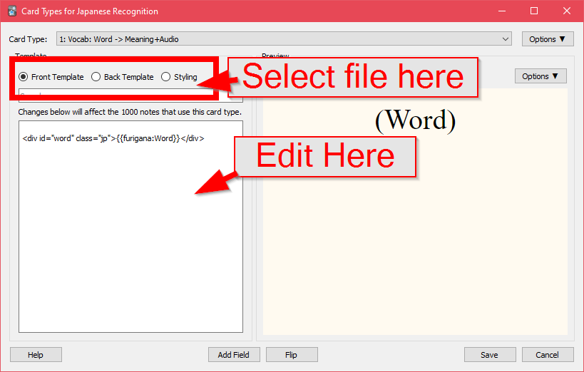
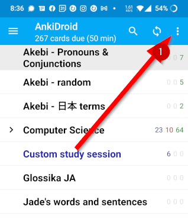
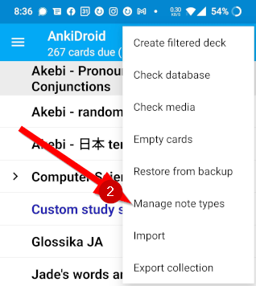
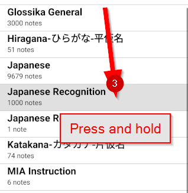
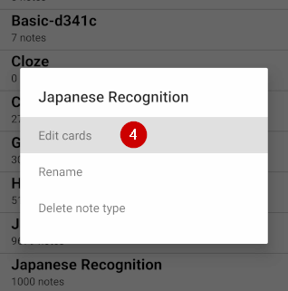
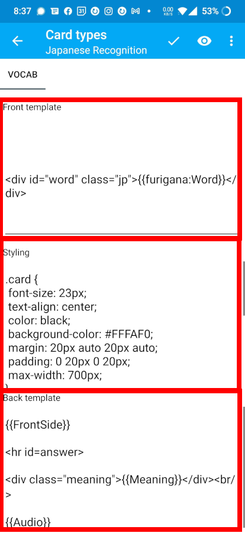

# How-To

These are some basic guides on how to mod your existing anki decks. There are instructions for Desktop and AnkiDroid (may also work similarly in AnkiMobile).

## What to do if you screw up

Don't panic.

### Reset to default

Copy what's in the files in this repository into your **【card type】**

For **jp1k** that's going to be the files under (/Refold-Deck-Mods/jp1k/base)[jp1k/base]. Go into your "Japanese Recognition" **【note type】** and copy over the file contents into your "1: Vocab: Word -> Meaning+Audio" **【card type】**'s template fields.

This should revert the deck to its normal state.

## Information 

You can skip to the next section if you just want to get to modding. If you want to understand about what we're doing here, there's some information here for you.

Anki uses a (somewhat confusing) system to create the cards you see while reviewing. When you add something to a deck, you select a **【note type】** which gives you fields to fill in with information. Once you fill out the fields in the **【note】** Anki now has the information and the deck will now have a **【card】** for each **【card type】** associated with that **【note type】**. The **【note type】**'s are shared between all your decks and most decks you download have a custom one bundled with them. Every time you add an additional **【card type】** to a **【note type】**, all the existing **【note】**'s will generate new cards in the decks they're in.

All the mods in this resource modify the **【card type】** options. When modifying them, **【card type】**s have three things we care about:

- Front Template & Back Template
  - HTML documents: structures what's shown on the front and back of the **【card】** and which fields to pull from the **【note】** (i.e. what you see before you click "Again/Good/etc" and what you see after)
- Styling
  - A CSS document: Contains style, font, color and other information that is used by the Front and Back templates.

Most of the changes these mods introduce are simply adding or changing the information in those three fields in Anki.

How do we do that? Read on...

## Desktop

Using the example of the JP1k Deck on windows, here is how you get to the right screen to the options for the **【card type】**. 

### Steps

Open Anki and follow these steps:

1. Navigate to the (Tools >> Manage Note Types) Dropdown
2. Scroll down and click the "Japanese Recognition" note type. This is JP1k's note type.
3. Click on the "Cards..." button on the right

4. You should now have a window open that looks like this:

5. Follow the instructions for the mod you are interested in by selecting the proper file from the radio buttons near the top and editing the text in the box below.

6. Hit save.

7. Test the deck using the card browser.

8. (Optional) if everything looks good, you can safely sync the deck.

## AnkiDroid/Mobile

It's easier to mod on the Desktop version of Anki and then use Sync to transfer the mod to your phone but if you're stuck on mobile, here are the steps to get to the JP1k Deck's **【card type】** edit screen.

Note: This process will be significantly easier in the near future once the deck customizer is finished. 

### Steps

Open the AnkiDroid app and follow these instructions:

1. Tap the three dot icon in the upper right 

2. Select "Manage note types" 

3. Scroll down until you find "Japanese Recognition". Press and hold the entry until a box pops up 

4. Select "Edit cards" 

5. You should now see a screen that looks similar to this. The three separate areas you can edit are highlighted 

6. Follow the instructions for the mod you want to install. Remember to scroll to the bottom of each box and paste the text on a new line.

7. Once you are finished, you can preview (the eye) or finish and save (checkmark) using the controls in the top right.